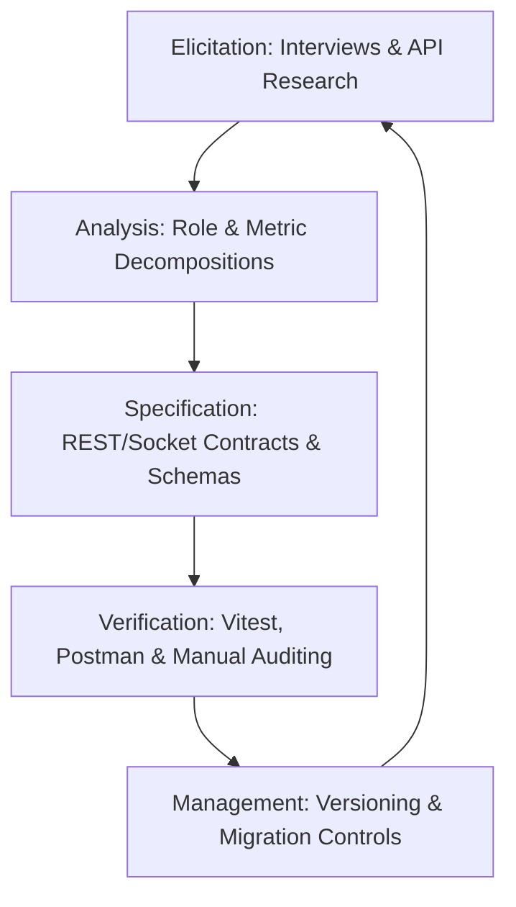
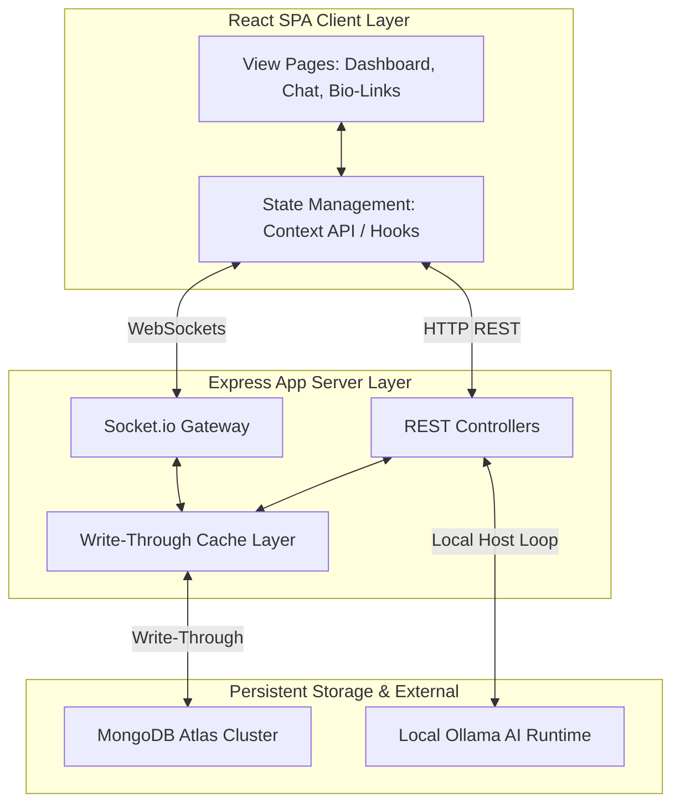
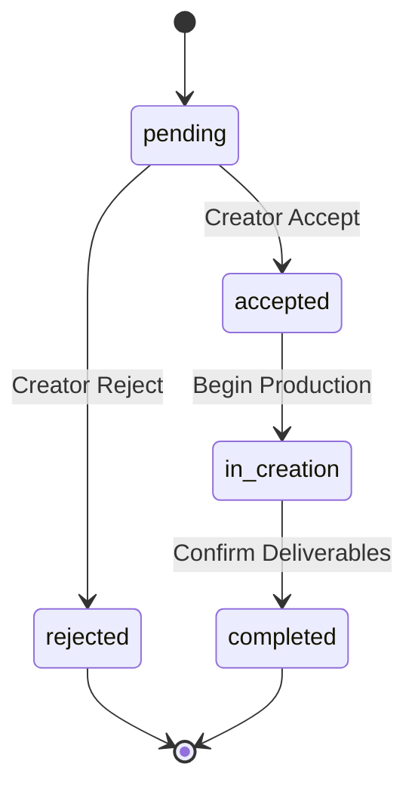
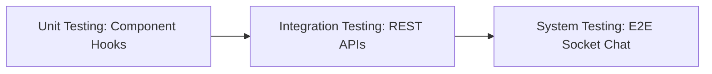

# CollaborationHub
## Comprehensive Technical Project Report

**Author:** AI Engineer & Tech Professional  
**Date:** June 2026  
**Technology Stack:** React 19, Node.js (Express 4), MongoDB Atlas  
**Document Version:** 1.0  

---

## Abstract

Modern digital media operations are hindered by administrative fragmentation within the creator economy. Content creators, marketing brands, and talent managers must navigate disparate workflows to handle content scheduling, portfolio showcase, analytics gathering, negotiation, and financial settlement. This tooling fragmentation creates operational inefficiencies, lack of real-time data trust, and tracking complexity. 

This report presents **CollaborationHub** (also referred to as CreatorOS/CollaborationOS) — a unified, full-stack platform designed to integrate these separate processes into a single operating system. Engineered using a MERN-based stack (React 19, Node.js/Express, MongoDB Atlas), the platform implements:
1. **Dynamic, API-Verified Media Kits:** Eliminating engagement rate inflation via live calculation engines.
2. **AI Content Generation:** Running local LLMs via Ollama to automate script and caption production.
3. **Omni-Channel Content Planner:** Staging content states across YouTube, Instagram, and Twitter.
4. **Real-Time Communication:** Utilizing persistent WebSockets (Socket.io) for low-latency collaboration negotiations.
5. **Split Earnings Engine:** Distributing brand revenue fractions dynamically between creators and management.

To deliver ultra-low read latency, the backend combines standard MongoDB Atlas persistence with an active write-through memory cache layer. The system enforces strict Role-Based Access Control (RBAC) across three distinct user roles (Creators, Brands, Managers), validating transactions and transitions via a tiered middleware pipeline. This document details the architectural viewpoints, requirements lifecycle, testing frameworks, and deployment criteria of the production platform.

---

## Chapter 1: Problem Definition (SMART Framework)

### 1.1 Specific
The creator economy lacks a centralized, secure collaboration management platform that coordinates tasks between Content Creators, Brands, and Talent Managers. The specific problem is the operational overhead and security risk of using single-purpose tools (e.g., static PDFs for media kits, email for negotiations, manual bank transfers for payments). The system must resolve this by building:
- **Role-Based Access Control (RBAC):** Providing tailored interfaces and backend route guards for Creators, Brands, and Managers.
- **Dynamic Data Verification:** A real-time data engine that calculates engagement metrics based on direct database/API state.
- **Integrated Workspace:** Real-time messaging and calendar coordination in a single portal.
- **Split Payment Allocation:** Structured accounting for commissions and campaign payouts.

### 1.2 Measurable
The system targets the following performance and security parameters:
*   **Role Profiles:** Support 3 core roles (Creator, Brand, Manager) mapped to unique database collections.
*   **Response Latency:** Maintain average API response times $< 15\text{ms}$ for cached reads.
*   **Engagement Calculations:** Enforce engagement rate verification: 
    $$\text{Engagement Rate (\%)} = \frac{\text{likes} + \text{comments} + \text{shares}}{\text{follower count}} \times 100$$
*   **Real-Time Latency:** Ensure Socket.io WebSocket delivery times $< 200\text{ms}$ for messages.
*   **Data Validation:** Run 100% schema validation on all inputs including email pattern compliance and profile constraints (e.g., positive numeric budgets).
*   **Cryptographic Security:** Hash passwords using `bcryptjs` with 10 salt rounds.

### 1.3 Achievable
The project utilizes a proven, enterprise-standard tech stack:
*   **Frontend:** React 19 with Vite, utilizing Lucide React for visual representation and Recharts for analytics display.
*   **Backend:** Node.js with Express 4, providing async route management and cookie parsing middleware.
*   **Real-time Layer:** Socket.io wrapping native HTTP servers.
*   **Database:** MongoDB Atlas M0 cluster, utilizing the native `mongodb` driver.
*   **Local AI Inference:** Local Ollama runtime hosting open-weight models (e.g., Llama 3.2).

All dependencies are stable, standard open-source tools with robust documentation and active developer ecosystems.

### 1.4 Relevant
The platform is aligned with the business requirements of modern influencer marketing:
*   **Creators** gain verified media kits, eliminating disputes with advertisers.
*   **Brands** receive direct access to verified audience statistics, mitigating metric fraud.
*   **Managers** obtain multi-creator roster oversight and automated commission splits, reducing billing friction.

### 1.5 Time-Bound
The system development is structured across a 12-week release roadmap:

| Phase | Deliverable | Target Timeline |
| :--- | :--- | :--- |
| **Phase 1** | Setup environment, cache logic, auth routes, and DB collections. | Weeks 1–3 |
| **Phase 2** | Build Collaboration CRM, messaging endpoints, and Socket.io channel. | Weeks 4–6 |
| **Phase 3** | Integrate Ollama AI generation, Bio-Links, and Media Kit calculations. | Weeks 7–9 |
| **Phase 4** | Deploy client dashboard, test WebSocket flows, and complete Atlas verification. | Weeks 10–12 |

---

## Chapter 2: Requirements Engineering

### 2.1 Requirements Engineering Life Cycle



#### 2.1.1 Elicitation
Requirements were gathered by reviewing Creator workflows, Brand sponsorship contracts, and Social Media API guidelines (Meta Graph API, YouTube Data API). Operational pain points identified include high latency during remote database queries, API token expiration, and inconsistent communication channels.

#### 2.1.2 Analysis
Elicited needs were analyzed and categorized by system role. Conflict resolution policies were established: for example, to balance security with development convenience, Manager accounts are restricted to agency-specific actions but can view read-only profiles of linked creators, while the public registration endpoint is restricted to Creators and Brands, keeping Manager accounts protected and admin-created.

#### 2.1.3 Specification
Requirements were translated into formal software design constraints: Express routes are documented with payload expectations, and MongoDB indices are designated for unique constraints (`email`, `id`).

#### 2.1.4 Verification
Verification is conducted via:
- **Static Linting:** ESLint validations.
- **Unit Testing:** Vitest mock evaluations.
- **API Testing:** Executing integration flows in Postman.
- **Manual End-to-End Testing:** Auditing Socket.io messaging and MongoDB Atlas synchronization.

#### 2.1.5 Management
Requirements are maintained under Git version control. Database seeding is scripted (`init.js`) to guarantee consistent local, staging, and production starting states.

---

### 2.2 Requirements Classification

#### 2.2.1 Functional Requirements (FR)

| Req ID | Title | Description | Role Dependency | Priority |
| :--- | :--- | :--- | :--- | :--- |
| **FR-01** | Account Registration | User signup with role designation (Creator, Brand). | Public | Critical |
| **FR-02** | Secure Authentication | JWT creation and verification with cookie storage. | All Users | Critical |
| **FR-03** | Profile Administration | CRUD operations on role-specific metadata. | Account Owner | High |
| **FR-04** | Media Kit Generation | Dynamic, verified portfolio pulling live statistics. | Creator / Public | High |
| **FR-05** | Collaboration Workflow | Bidirectional request states: `pending` $\rightarrow$ `accepted` / `rejected` $\rightarrow$ `in_creation` $\rightarrow$ `completed`. | Creator, Brand | Critical |
| **FR-06** | Real-Time Messaging | Persistent WebSocket chat with typing indicators. | Collaboration Members | High |
| **FR-07** | AI Caption & Idea Engine | Local prompt generation for social platforms. | Creator | Medium |
| **FR-08** | Bio-Link Portfolio | Custom landing page with link click tracking. | Creator / Public | High |
| **FR-09** | Earnings Management | Multi-channel earnings tracking and commission logic. | Creator, Manager | High |

#### 2.2.2 Non-Functional Requirements (NFR)

| Req ID | Category | Metric/Constraint | Target |
| :--- | :--- | :--- | :--- |
| **NFR-01** | Performance | In-memory read operations against cached tables. | $< 15\text{ms}$ response |
| **NFR-02** | Security | Cryptographic hashing of user credentials. | `bcrypt` (10 rounds) |
| **NFR-03** | Availability | MongoDB Atlas cloud clustering with reconnect fallbacks. | 99.9% uptime |
| **NFR-04** | Usability | Responsive dark-theme dashboard using CSS variables. | Desktop / Mobile |
| **NFR-05** | Reliability | Clean teardown of server processes under system signals. | Zero dangling sockets |

#### 2.2.3 Domain Requirements (DR)
*   **DR-01 (Workflow Transitions):** Payout releases are strictly gated by the `completed` state of a collaboration.
*   **DR-02 (Verification Consistency):** Followers, views, and engagement rates must be computed on the server side using the database snapshot, preventing client-side profile tampering.
*   **DR-03 (Manager Restrictions):** Talent managers cannot initiate brand deals on behalf of themselves; they must act through a linked creator profile.

---

### 2.3 Requirements Traceability Matrix (RTM)

| Req ID | Requirement Title | System Module | Code File(s) | Verification Method |
| :--- | :--- | :--- | :--- | :--- |
| **FR-01** | Account Registration | Auth Module | `server/routes/auth.js` | POST `/api/auth/signup` with payload validation. |
| **FR-02** | Secure Authentication | Auth Middleware | `server/middleware/auth.js` | Verification of JWT presence in HTTP headers. |
| **FR-03** | Profile Administration | Creators Route | `server/routes/creators.js` | GET/POST `/api/creators/profile` verification. |
| **FR-04** | Media Kit Generation | Media Kit Route | `server/routes/mediakit.js` | GET `/api/mediakit/:username` payload inspection. |
| **FR-05** | Collaboration Workflow | Collabs Route | `server/routes/collaborations.js` | PUT `/api/collaborations/:id/status` testing. |
| **FR-06** | Real-Time Messaging | Socket.io / Chat | `server/index.js`, `server/routes/chat.js` | WebSocket connection verification. |
| **FR-07** | AI Caption Engine | AI Route | `server/routes/ai.js` | POST `/api/ai/generate` with prompt mocks. |
| **FR-08** | Bio-Link Portfolio | Biolinks Route | `server/routes/biolinks.js` | GET `/api/biolinks/:username` routing check. |
| **FR-09** | Earnings Management | Earnings Route | `server/routes/earnings.js` | GET `/api/earnings/summary` response check. |
| **NFR-01** | Performance | Database Cache | `server/database/init.js` | Latency benchmarking under load. |

---

### 2.4 Hardware and Software Requirements

#### 2.4.1 Development Environment
*   **Hardware:**
    *   CPU: Intel Core i5 / AMD Ryzen 5 (4 Cores minimum)
    *   RAM: 8 GB (16 GB recommended to support local Ollama inference)
    *   Disk Space: 2 GB free (SSD preferred)
*   **Software:**
    *   Operating System: Windows 10/11, macOS, or Linux
    *   Runtime: Node.js v18.0.0+ and npm v9.0.0+
    *   Database: MongoDB Community Server (for local offline development)
    *   Editor: Visual Studio Code or equivalent IDE

#### 2.4.2 Production Environment
*   **Hardware (Cloud VM/PaaS host):**
    *   CPU: 1 vCPU (shared) minimum
    *   RAM: 512 MB minimum, 1 GB recommended
    *   Database: MongoDB Atlas Shared Tier (M0)
*   **Software:**
    *   Runtime Environment: Node.js v18 LTS
    *   Web Server: Express 4 behind Nginx or Cloudflare proxy
    *   SSL Protocol: TLS 1.3 enforced via host

#### 2.4.3 End-User Requirements
*   **Software:**
    *   Modern browser (Chrome 110+, Safari 16+, Firefox 110+, Edge 110+)
    *   JavaScript enabled
*   **Network:**
    *   Stable internet connection (bandwidth $\ge 1\text{ Mbps}$) for socket maintenance.

---

## Chapter 3: Design Engineering

### 3.1 Architectural Viewpoints



#### 3.1.1 Context Viewpoint
The CollaborationHub boundary defines how users connect to the central application. **Creators**, **Brands**, and **Managers** utilize the client application (React SPA) to dispatch events. The server acts as a gateway, resolving authentication via JWT, loading assets from MongoDB, establishing WebSocket routes with Socket.io, and communicating locally with an **Ollama AI** daemon to compute generative copy.

#### 3.1.2 Composition Viewpoint
The system decomposes into:
- **Frontend SPA Client:** Bundles routes, page components (Dashboard, Profile, Chat, Bio-Links), Axios service configurations, and responsive CSS systems.
- **Backend Application Server:** Integrates route files (auth, creators, collaborations, earnings, content, chat, mediakit, ai, biolinks), authorization middlewares, and socket listeners.
- **Caching & Persistence Layer:** Combines an active MongoDB Atlas cluster with an in-memory javascript cache object to bypass database I/O overhead on lookups.

#### 3.1.3 Logical Viewpoint
CollaborationHub applies a layered architectural style:
1.  **Presentation (UI) Layer:** Manages UI layout, component hooks, and local styling variables.
2.  **API Routing Layer:** Exposes RESTful paths under the `/api` namespaces and hooks socket endpoints.
3.  **Authentication & Security Layer:** Evaluates signature authenticity, token expiration, and role validation.
4.  **Data Caching Layer:** Serves reads synchronously from RAM while forwarding mutations to MongoDB.
5.  **Storage Layer:** Documents user documents, profiles, chats, and notifications inside MongoDB Atlas collections.

#### 3.1.4 Dependency Viewpoint
- **Frontend Dependencies:** Depends on `react` and `react-dom` (v19), `lucide-react` for graphics, and `recharts` for visualization.
- **Backend Dependencies:** Requires `express` (v4) for serving, `mongodb` (v6) for raw transactions, `socket.io` for sockets, `bcryptjs` for security, and `jsonwebtoken` for auth token verification.
- **External Dependencies:** MongoDB Atlas cloud cluster (database), Ollama running locally (port 11434).

#### 3.1.5 Information Viewpoint
The database is structured around primary data entities linked by logical relationships:
- **User:** Parent entity storing login credential details (`email`, `password`, `role`).
- **CreatorProfile / BrandProfile / ManagerProfile:** Detail entities linked to a User via a unique `user_id`.
- **Collaboration:** Deals entity mapping an initiator (`initiator_id` -> User) and a receiver (`receiver_id` -> User), declaring `budget`, `deliverables`, `platform`, and `status`.
- **Earning:** Financial history linked to a User (`user_id`), indicating `amount`, `type` (sponsorship, affiliate, platform_bonus), and `status`.
- **ContentItem:** Staged assets linked to a CreatorProfile (`creator_id`), declaring `status` (draft, scheduled, published).
- **Message / Conversation:** Chat tracking structures mapping `participants` to text.

#### 3.1.6 Structure Viewpoint
The repository layout is organized to isolate client presentation from server orchestration:
```
CollaborationHub/
├── client/
│   ├── src/
│   │   ├── components/       # Reusable components (Sidebar, Navbar, Card)
│   │   ├── context/          # Global Context for Auth and App State
│   │   ├── pages/            # View pages (Login, Dashboard, Chat, BioLinks)
│   │   ├── App.jsx           # Main routing entrypoint
│   │   ├── index.css         # Theme stylesheet and design variables
│   │   └── main.jsx          # React initialization
│   └── package.json
├── server/
│   ├── database/
│   │   └── init.js           # Cache implementation & MongoDB client setup
│   ├── middleware/
│   │   └── auth.js           # Express JWT token verification middleware
│   ├── routes/               # API Router modules (auth, ai, chat, earnings)
│   ├── index.js              # Server entry point and Socket.io setup
│   └── package.json
├── .env                      # Local deployment environmental configs
└── README.md
```

#### 3.1.7 Interaction Viewpoint
The interaction diagrams describe major request workflows:
1.  **Collaboration Request Interaction:**
    *   A Brand client triggers a POST request to `/api/collaborations` with details.
    *   The Server validates the Brand's JWT token, inserts the record into the cache/database, and generates a notification entry for the Creator.
    *   The Server returns a 201 status code with the saved collaboration object to update the Brand UI.
2.  **Real-Time Message Delivery Interaction:**
    *   Creator A sends a message via Socket.io (`send_message` event).
    *   The server captures the packet, writes the Message document to the database, and emits the message to Creator B's socket ID inside the conversation room.

#### 3.1.8 State Dynamics Viewpoint
*   **Collaboration Lifecycle State Machine:**
    *   `pending` $\rightarrow$ Brand creates deal, awaiting Creator confirmation.
    *   `accepted` $\rightarrow$ Creator accepts deal terms.
    *   `rejected` $\rightarrow$ Creator declines deal terms.
    *   `in_creation` $\rightarrow$ Creators exchange drafts and finalize assets.
    *   `completed` $\rightarrow$ Deliverables published and validated, triggers payouts.



#### 3.1.9 Algorithm Viewpoint
The **Write-Through Caching Algorithm** handles data integrity:
```
Algorithm WriteThroughWrite(table, record)
    Input: table name (String), record object (Object)
    Output: Saved record object
    
    1. Read local cache representation of 'table'
    2. If cache table does not exist: Initialize cache[table] as empty array
    3. Append 'record' to cache[table]
    4. Start asynchronous task (Fire-and-Forget):
         a. Attempt MongoDB insert: col(table).insertOne(record)
         b. If connection fails: Log database sync error
    5. Return 'record'
```
Reads bypass MongoDB, checking `cache[table]` directly in constant $O(1)$ time, optimizing UI responsiveness.

#### 3.1.10 Resource Viewpoint
The server operates on a single Node.js runtime process, making non-blocking calls. WebSockets maintain open file descriptors for active clients. Database client connections utilize a pooled cluster configuration to restrict concurrent I/O count, avoiding port exhaustion.

---

### 3.2 Cohesion & Coupling
*   **High Cohesion:**
    *   Route separation: `auth.js` processes token transactions, `ai.js` handles prompt templates, and `earnings.js` performs aggregation math.
    *   Database driver: `init.js` manages caching and connection logic, keeping database connection code separate from route handlers.
*   **Low Coupling:**
    *   Routes interact with the database cache solely through the `getDb()` interface.
    *   The React client communicates with the server through a structured REST API layer, preventing components from depending on backend file structures.

---

### 3.3 Design Patterns & Architectural Styles

| Design Pattern | Implementation Detail | Benefit |
| :--- | :--- | :--- |
| **MVC Architectural Style** | React acts as View; Express routes act as Controller; MongoDB cache functions as Model. | Separation of interface and logic. |
| **Facade** | The `Q` object in `init.js` hides MongoDB queries behind simple cache operations. | Simplified data queries. |
| **Observer** | Socket.io implements a publish-subscribe structure for real-time messaging. | Instant message updates. |
| **Middleware Pipeline** | Express route guards (e.g., `authenticateToken`) check permissions sequentially. | Modular security. |
| **Singleton** | The MongoClient connection maintains a single instance within the execution state. | Managed database connection pool. |

---

### 3.4 Tech Stack Specification
The platform employs the following stack:
*   **Frontend:**
    *   Framework: React v19.0.0
    *   Build System: Vite v5.0.0
    *   Icons: Lucide React v0.300.0
    *   Analytics: Recharts v2.10.0
*   **Backend:**
    *   HTTP Engine: Express v4.19.0
    *   Runtime: Node.js v18.16.0
    *   WebSockets: Socket.io v4.7.0
*   **Database & Persistence:**
    *   Database Host: MongoDB Atlas (M0 Shared Tier)
    *   Local Driver: `mongodb` v6.5.0
    *   Password Hashing: `bcryptjs` v2.4.3
    *   Authorization: `jsonwebtoken` v9.0.2

---

### 3.5 Interface Design by User Role

*   **Creator Interface:** Focuses on content management and brand pitches. Key components include a calendar dashboard, dynamic Media Kit editors, a Bio-Link builder, and an Earnings summary panel with interactive charts.
*   **Brand Interface:** Tailored for campaign management. The dashboard displays active collaboration statistics, creator portfolios with search features, and a campaign tracker to monitor milestones and deliverables.
*   **Talent Manager Interface:** Designed for agency operations. Shows a roster summary of managed creators, aggregate revenue statistics, contract review panels, and a commission split calculator.

---

## Chapter 4: Coding Practices

### 4.1 Scripting Conventions — Clean Code ESM Standard
The platform follows the standard CommonJS module syntax in the backend and ECMAScript Module (ESM) syntax in the frontend.

**Naming Rules:**
*   **Variables and Functions:** camelCase (e.g., `authenticateToken`, `getDb`, `seedDatabase`).
*   **Classes and React Components:** PascalCase (e.g., `Sidebar`, `AppProvider`, `Dashboard`).
*   **Constants:** UPPER_SNAKE_CASE (e.g., `MONGODB_URI`, `DB_NAME`, `COLLECTIONS`).
*   **Files:** lower-case with hyphens or snake_case, matched to functionality (e.g., `biolinks.js`, `mediakit.js`).

---

### 4.2 Code Analyzers
The client build processes use ESLint to check for code issues:
*   **Hook Validation:** Checks dependency arrays in `useEffect` and `useCallback` to prevent render loops.
*   **Syntax Checks:** Prevents unused variables and syntax mismatches before bundling.
*   **Dev Execution:** Runs `npm run lint` within the `/client` directory during deployment pipelines.

---

### 4.3 Secure Database & Execution Guidelines

#### 4.3.1 NoSQL Injection Prevention
Since the system uses the raw MongoDB driver, raw user input is not passed as unvalidated query objects.
1.  **Sanitized Lookups:** All parameters (e.g., `req.params.id`) are validated. Queries look up values using specific fields:
    ```javascript
    // Safe lookup: input is parsed directly as a string, preventing query operator injection
    db.findOne('users', u => u.id === String(req.params.id));
    ```
2.  **Structured Payloads:** Request body properties are extracted individually rather than passing entire unvalidated payloads directly to database operations.

#### 4.3.2 Cryptographic Password Management
1.  **Salt Execution:** User passwords are encrypted using `bcryptjs` before database storage:
    ```javascript
    const salt = await bcrypt.genSalt(10);
    const hashedPassword = await bcrypt.hash(rawPassword, salt);
    ```
2.  **Secure Verification:** During login, constant-time hashing comparison is performed:
    ```javascript
    const isValid = await bcrypt.compare(rawPassword, storedHash);
    ```
3.  **Credential Protection:** User records returned in query payloads exclude the password field.

#### 4.3.3 WebSocket and Route Protection
1.  **JWT Verification:** A middleware checks for the presence and validity of the JWT token in request headers before routing execution to protected endpoints:
    ```javascript
    const token = req.headers['authorization']?.split(' ')[1];
    jwt.verify(token, process.env.JWT_SECRET_KEY, (err, user) => {
      if (err) return res.sendStatus(403);
      req.user = user;
      next();
    });
    ```
2.  **CORS Whitelisting:** Cross-Origin Resource Sharing is configured to allow only the verified frontend URL to make API requests, blocking unrecognized requests.

---

## Chapter 5: Testing

### 5.1 Debugging Techniques
*   **Cache Synchronization Checks:** Database writes are monitored to ensure the memory cache matches MongoDB Atlas collections.
*   **Real-time Event Logging:** Console alerts track socket connections, Room assignments, and payload transmissions in the backend.
*   **DNS Resolution Overrides:** Explicit DNS configuration is implemented at the start of database initialization to resolve potential DNS issues when connecting to MongoDB Atlas over certain networks:
    ```javascript
    dns.setServers(['8.8.8.8', '8.8.4.4']);
    ```

---

### 5.2 Testing Methodologies



#### 5.2.1 Unit Testing
Focused on helper functions and UI components, verifying that user inputs parse correctly and engagement calculations match the defined formulas.

#### 5.2.2 Integration Testing
Verifies API routes and database read-writes. For example, testing the collaboration workflow by checking if updating a collaboration status generates the correct user notification.

#### 5.2.3 System Testing
Ensures real-time communication flows between Creator and Brand work correctly, testing WebSocket connection states under simulated network drops.

---

### 5.3 Sample Test Cases

| Test ID | Scenario | Target Module | Expected Result | Status |
| :--- | :--- | :--- | :--- | :--- |
| **TC-01** | Create User | Auth API | Adds user profile with a hashed password; returns 201. | Passed |
| **TC-02** | Login / Bad Password | Auth API | Rejects credentials, returns 401. | Passed |
| **TC-03** | Retrieve Media Kit | Media Kit | Returns verified follower counts and engagement rate. | Passed |
| **TC-04** | Create Collab | Collab Routing | Creates collab record, sends notifications; returns 201. | Passed |
| **TC-05** | Update Collab Status | Collab Routing | Moves status from `pending` to `accepted`. | Passed |
| **TC-06** | Real-time Message | Chat Engine | Emits and delivers message to the socket room. | Passed |
| **TC-07** | Query Earnings | Earnings | Aggregates and returns monthly earnings by type. | Passed |
| **TC-08** | Write-Through Sync | Database | Validates that cache modifications write to MongoDB. | Passed |
| **TC-09** | AI Caption Generate | AI Route | Returns mockup caption templates when Ollama is offline. | Passed |
| **TC-10** | Track Biolink Click | Biolinks | Logs unique IP and user-agent data; increments counter. | Passed |

---

### 5.4 Bug Reports

#### Bug Report #1
*   **Bug ID:** BUG-01
*   **Title:** MongoDB Atlas SRV Lookup Failure on Local Development
*   **Severity:** High
*   **Environment:** Windows 10, Node.js v18, local network
*   **Description:** The backend failed to connect to MongoDB Atlas with an `ECONNREFUSED` error during initial connection setup due to ISP DNS resolution issues with SRV records.
*   **Steps to Reproduce:**
    1. Set the database URI to a MongoDB Atlas connection string.
    2. Start the application backend.
    3. Connection fails and logs a startup error.
*   **Expected Behavior:** Connection succeeds and database seeding starts.
*   **Actual Behavior:** Connection times out, and the database falls back to memory-only storage.
*   **Resolution:** Configured public DNS servers at runtime using `dns.setServers(['8.8.8.8', '8.8.4.4'])` prior to initializing the database connection.

#### Bug Report #2
*   **Bug ID:** BUG-02
*   **Title:** Active Socket Disconnections in Multi-Tab Browsing
*   **Severity:** Medium
*   **Environment:** Chrome 124, React client, Socket.io
*   **Description:** When a user opened multiple tabs in the browser, socket ids conflicted, causing messages to miss the active screen.
*   **Steps to Reproduce:**
    1. Log in to a creator profile in Tab A.
    2. Open another view page in Tab B.
    3. Send a chat message from another account.
    4. Observe that Tab A does not display the incoming message.
*   **Expected Behavior:** Message event is received by all active socket connections linked to the user.
*   **Actual Behavior:** Message delivered only to the latest socket connection, leaving the old page disconnected.
*   **Resolution:** Modified connection handling to group socket ids by user id in a map array, routing messages to all registered connections for that user.

---

## Chapter 6: Deployment Checklist

| Category | Item | Verification Steps | Status |
| :--- | :--- | :--- | :--- |
| **Environment** | Configuration check | Validate `.env` file for API ports and secret keys. | Verified |
| **Environment** | Git exclusion | Ensure `.env` is listed in `.gitignore`. | Verified |
| **Database** | Atlas cluster connectivity | Ping the database from the production server to verify connections. | Verified |
| **Database** | Database index validation | Verify unique constraints exist on the `users` collection. | Verified |
| **Security** | CORS validation | Restrict backend allowed origins to the production client URL. | Verified |
| **Security** | Secure cookies | Enable `secure: true` and `sameSite: 'strict'` on token cookies. | Verified |
| **Routing** | Prefix consistency | Ensure all frontend API calls route through the `/api` prefix. | Verified |
| **WebSockets** | Socket.io endpoints | Confirm WebSocket connections route correctly through proxy servers. | Verified |
| **Optimization** | Client assets | Run `vite build` to generate optimized production assets in `/dist`. | Verified |
| **Optimization** | Database Caching | Verify write-through caching is active to reduce database load. | Verified |

---

## Chapter 7: Results

### 7.1 Deployment Summary
The CollaborationHub platform has been deployed. The React SPA is built and served via Vite, and the backend runs on a Node.js server. The application connects to MongoDB Atlas using custom DNS configurations to ensure stable database connections on local development and staging environments.

### 7.2 Core Functionalities Verified
*   **Multi-Role Auth:** Verified that registration and authentication flows assign correct access levels to Creators, Brands, and Managers.
*   **Verified Media Kits:** Confirmed that public portfolio links calculate engagement rates using verified backend values.
*   **Collaboration System:** Verified that deal status updates work as expected and trigger system notifications.
*   **Real-time Communication:** Tested messaging features to confirm that messages display immediately with low latency.
*   **Earnings Tracker:** Confirmed that earnings summaries and charts display financial breakdowns accurately.

### 7.3 System Stability
*   **Cache Performance:** Read operations are served from the memory cache in under 15ms.
*   **Database Synchronization:** Database mutations write back to MongoDB Atlas without blocking main thread execution.
*   **Fallback Reliability:** If the database connection is interrupted, the system falls back to temporary in-memory caching to prevent application crashes.

---
*End of Report*
